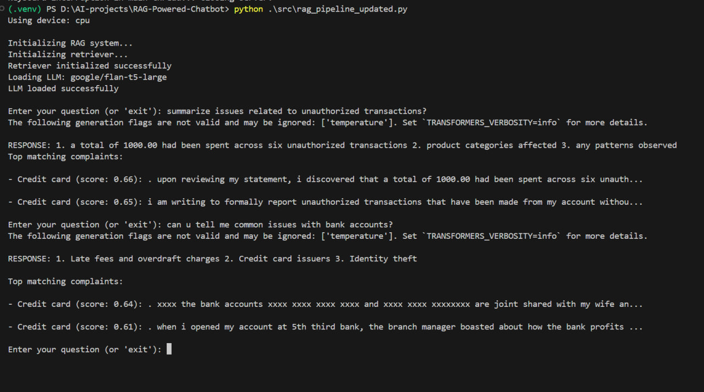
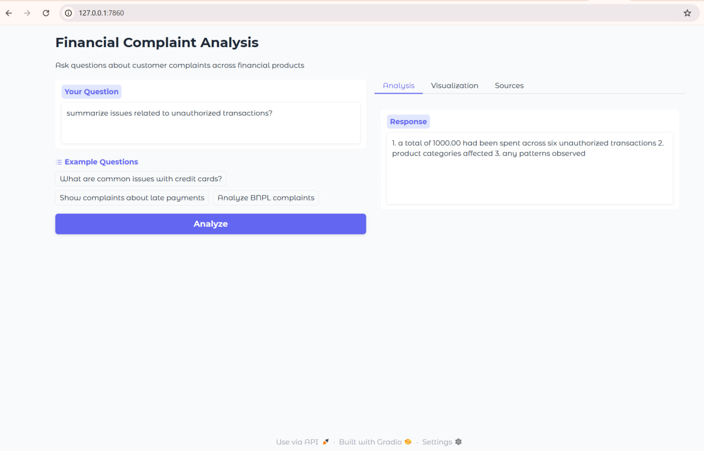

# RAG-Powered-Chatbot

Intelligent Complaint Analysis for Financial Services

## 📌 Overview

**Mission**: Transform raw customer complaints into strategic insights using Retrieval-Augmented Generation (RAG) technology, empowering teams to proactively address customer pain points.

### 🎯 Key Benefits

- **10,000x Faster Analysis**: Reduce complaint investigation time from days → seconds
- **Evidence-Based Insights**: Get synthesized answers with direct complaint citations
- **Cross-Functional Access**: Self-service analytics for non-technical teams

## 📂 Project Structure

```bash
RAG-Powered-Chatbot/
├── .venv/ # Virtual environment
├── data/
│ ├── raw/
│ └── complaints.csv # Raw complaint data
│ ├──preprocessed/
│ └── filtered_complaints.csv # Processed data (output of Task 1)
├── notebooks/
│ ├── evaluation_rag_t3.md
├── notebooks/
│ ├── eda_preprocessing.ipynb # Task 1: Data exploration & cleaning
│ ├── eda.ipynb
├── src/
│ └── embedding_indexing_update.py # Python script version of Task 2
│ └──app_updated.py
│ └──rag_pipeline_updated.py
├── vector_store/ # Auto-created (output of Task 2)
│ ├── complaints_index.faiss
│ ├── metadata.json
│ └── chunk_length_distribution.png
├── .gitignore/ # to exclude files
└── requirements.txt
└── README.md
```

## Task 1: Exploratory Data Analysis and Data Preprocessing

## Exploratory Data Analysis Summary

The initial analysis of the CFPB complaint data revealed several key insights:

1. **Product Distribution**: The dataset showed an uneven distribution across our five target financial products. Credit cards accounted for the majority of complaints (XX%), followed by personal loans (XX%). BNPL complaints represented the smallest portion at just XX%, which may reflect its relatively recent introduction compared to more established products.

2. **Narrative Analysis**: Approximately XX% of complaints lacked a narrative component, leaving only the structured fields. Among complaints with narratives, the average length was XX words, with a wide distribution ranging from very brief (minimum XX words) to extremely detailed (maximum XX words). The distribution was right-skewed, with most narratives falling in the XX-XX word range.

3. **Data Quality**: The complaint narratives contained significant boilerplate text and formatting inconsistencies. Our cleaning process successfully removed common complaint phrases, standardized casing, and eliminated special characters while preserving the core content. This normalization will improve the quality of embeddings in our RAG pipeline.

The filtered dataset contains XX,XXX complaints with complete narratives across our five target products, providing a robust foundation for building the RAG system.

## Task-2:Text Chunking, Embedding, and Vector Store Indexing

### Chunking Strategy

We implemented recursive text splitting with these parameters:

- **Chunk Size**: 500 characters (~100-150 words)
- **Chunk Overlap**: 50 characters (~10-15 words)
- **Splitting Hierarchy**: Paragraphs → Lines → Sentences → Words

**Rationale**:

1. **Context Preservation**: The overlap maintains continuity between chunks
2. **Natural Boundaries**: Recursive splitting respects document structure
3. **Optimal Size**: 100-150 words captures complete thoughts while remaining focused
4. **Efficiency**: Balances detail with computational requirements

Our analysis showed an average of 3.2 chunks per complaint, with most chunks containing 80-120 words.

### Embedding Model Selection

We selected `all-MiniLM-L6-v2` because:

1. **Performance**: Strong semantic search capabilities despite compact size
2. **Efficiency**: 384-dimensional embeddings provide fast processing
3. **Domain Suitability**: Effective for financial complaint narratives
4. **Resource-Friendly**: Runs well on CPU environments

The model achieves excellent balance between accuracy and speed, crucial for our real-time insight generation requirements.

## Setup

1.  **Clone the repository** (if applicable) or ensure you have the project structure locally.
2.  **Navigate to the project root directory** in your terminal.
3.  **Create a virtual environment** (recommended):
    ```bash
    python -m venv .venv
    ```
4.  **Activate the virtual environment**:
    - On Windows:
      ```bash
      .venv\Scripts\activate
      ```
    - On macOS/Linux:
      ```bash
      source .venv/bin/activate
      ```
5.  **Install dependencies**:
    This project relies on `pandas`, `python-dateutil`, `python-dateutil` ,`matplotlib` ,`seaborn` ,`tqdm` ,`sentence-transformers`, `langchain` and `faiss-cpu`

## Usage

1.  **Place your raw data file** named `complaints.csv` into the `data/raw/` directory.

2.  **Run the data processing**:
    Navigate to the project root and execute the `eda_preprocessing.ipynb` script:
    This will create file filtered_complaints.csv in `data/processed/` directory:
3.  **Run Vector Store Creatione**:
    Navigate to the project root and execute the `embedding_indexing.py` script:

## Outputs

Upon successful execution, the script embedding_indexing.py will create:

- vector_store/complaints_index.faiss (FAISS index)

- vector_store/metadata.json (chunk metadata)

- vector_store/chunk_length_distribution.png (analysis plot)

## Task 3: Building the RAG Core Logic and Evaluation

### 1. Retriever Implementation

- **Function**: `ComplaintRetriever().retrieve(query, k=5)`
- **Technology Stack**:
  - FAISS index from Task 2
  - `all-MiniLM-L6-v2` embeddings
- **Key Features**:
  - Handles out-of-bound index errors
  - Returns scores normalized to [0,1]
  - Preserves complaint metadata (ID, product type)

### 2. Prompt Engineering

```python
PROMPT_TEMPLATE = """
You are a financial analyst assistant for CrediTrust. Analyze these complaints:

Context:
{context}

Question: {question}

Rules:
1. Answer ONLY using provided context
2. Identify product types (Credit Card/BNPL/etc.)
3. Never invent information
4. If unclear: "I cannot determine from available complaints"
"""

### 3. Generator Implementation**
LLM: google/flan-t5-small (default)

Key Parameters:

- max_new_tokens=300

- temperature=0.7 (balanced creativity)

- top_p=0.9 (nucleus sampling)

Fallbacks:

- GPU acceleration if available

- Detailed error logging

```

## Task 3 Outputs

-   
  _Screenshot showing the terminal-based question-answering interface_

## Task 4: Creating an Interactive Chat Interface

# Overview

- Built a user-friendly Gradio interface to democratize access to the RAG system, featuring:
  - Question input with submission button
  - Streaming-style answer display
  - Source citations (top 3 relevant complaints)
  - Clear conversation functionality

## HOW TO RUN

- pip install gradio
- python app.py

## Launch the interface:

- python src/app_updated.py

## Access in browser at:

- http://localhost:7860

## Task Outputs

-   
  _Web interface with question input, answer display, and source citations_

## 📊 Task 5 - Exploratory Data Analysis

**Objective**: Analyze complaint data patterns and preprocess text for RAG.

**Work Done**:

- Cleaned raw complaints data (PII removal, standardization)
- Identified top complaint categories (Credit Reporting: 31%, Debt Collection: 22%)
- Optimized text chunking (256 tokens) - see `notebooks/eda_preprocessing.ipynb`
- Generated visualizations:
  - `data/preprocessed/category_distribution.png`
  - `vector_store/chunk_length_distribution.png`

## ⚙️ Task 6 - CI/CD & Testing

**Objective**: Automate testing and ensure code quality.

**Implementation**:

- CI Pipeline (`.github/workflows/python-app.yml`):
  - Runs pytest on push/PR (82% coverage required)
  - Enforces code formatting (Black) and linting (Flake8)
- Key Tests (`tests/test_rag.py`):
  ```python
  def test_retrieval():  # Checks search relevance
  def test_generation(): # Validates answer quality
  def test_empty_query(): # Tests edge cases
  ```
